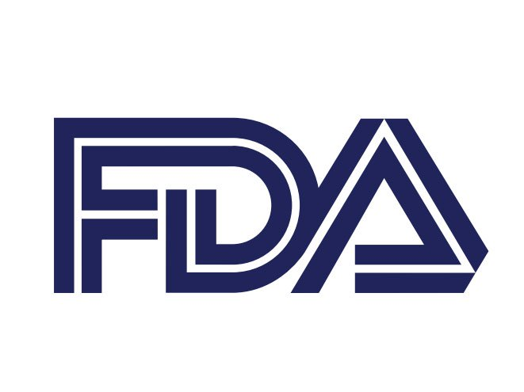

 <!DOCTYPE html>
<html>
  <head>
    
    <title> Missing Person: FDA</title>
    <meta charset="utf-8" />
	  <meta http-equiv="X-UA-Compatible" content="IE=edge" />
	  <meta name="viewport" content="width=device-width, initial-scale=1" />
	  <!-- link the webpage's stylesheet -->
	  <link rel="stylesheet" type = "text/css" href="style.css" />
	  <!-- link the webpage's JavaScript file -->
	  
  </head>
  <body>
    <header>
      <nav class = "front">
        <ul class = "navbar" class = "front">
          <li class = "navline" class = "front"> 
            <a href = "index.html"> Home </a>
          </li>
          <li class = "navline" class = "front">
            <a href = Additives.html> Additives </a>
          </li>
          <li class = "navline" class = "front">
            <a href = "GreedCap.html"> Corruption </a>
          </li>
          <li  class = "navline" class = "front">
            <a href = "LearnMore.html">Learn More</a>
          </li>
        </ul>
      </nav>
      

        

          

      <h1 >
What's "Safe" for you  is killing you
</h1>
      <h4 >
The United States continues to allow an abundance of harmful additives to seep into our diets, endangering our health. The root of these problems are intertwined in the FDA and capitalism 
</h4>
        

      

    </header>
    <main>
    

      

      <h2>Food For Thought</h2>
       
      <button id = "myBtn" class = "learn"> Learn </button>
       
       
      
There are many foods that the United States allows that can cause cancer, neurological defects, hormonal changes and other negative effects. Click the button to learn more. 

       
      
 

      

      
    

    

     
     
    <h2> FDA Timeline</h2>
     
        
 <b>1906: </b>The Food and Drug 
Administration is established.

      
<b>1938:</b>The Federal Food, Drug and Cosmetic Act provided safe tolerance benchmarks, factory inspection and authorized standards for foods.

      
<b>1958:</b> Congress passed the Food Additive Amendment of 1958.

        
<b>1969:</b> President Nixon orders the FDA to review its food additives

        
<b>1973:</b> FDA revises food additives and GRAS regulations, which compiles a list of "Generally Recognized As Safe" foods.
  
         
<b>1982:</b>FDA launches a Priority-Based Assessment of Food Additives Program

          
<b>2010:</b>Government Accountability Office issues report finding flaws with GRAS program. An investigation found the the FDA does not ensure the saftey of new GRAS determination or the continued saftey of current foods on the GRAS list.

      
<b>2011:</b> Congress passes the FDA Food Saftey Moderniation Act, which forces the agency to regulate and prevent unsafe foods from entering the market.

     
    <h2> Investigations. Loopsholes. and Corruption</h2>
     
      
 Due to limited resources and blockage, the FDA began allowing additive manufactures to self-claim that their foods are GRAS. The goal of companies was to get FDA clearance without any questions, and this loophole has allowed virtually all companies to get GRAS exemptions.

      

        There are more than 10,000 chemicals permitted to be in human foods and many have been linked to cancer. With such a list, the FDA faces challenges on regulating these additives. They have not reviewed approximately 3,000 of these chemicals, and 1,000 were self-affirmed as GRAS by the manufactuers.
      

      

        Food industry influence, loss of experitise, lack of leadership, lack of funding, and greed for profits continues to sacrifice the health of the Americans. American Food Regulations and Guidelines continue to fall behind European and Asian countries as capitalism continues to take precednece over the well-being of people. 
      
   
    
 
    </main>
<footer>
  
 Author: Naomi Gong

  <a href = LearnMore.html> Resources </a>
   
   
   
</footer>
  </body>
</html>

